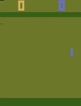
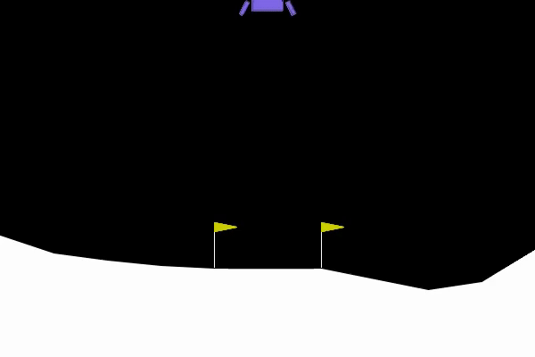

# Project2: Reinforcement Learning

This project implements reinforcement learning algorithms on different Gymnasium environments. It uses the Stable-Baselines3 library to train and evaluate RL agents on Atari, Classic Control, and Box2D environments.

## Setup Instructions

1. Create conda environment:
```bash
conda env create -f environment.yml
```

2. Activate the environment:
```bash
conda activate aic_project2
```

## Project Structure

- `src/`: Source code directory
  - `main.py`: Main training and testing script
  - `utils.py`: Utility functions for environment creation, evaluation, and video recording
- `results/`: Training results and model weights
- `videos/`: Recorded GIFs of trained agents
- `requirements.txt`: Python package requirements
- `environment.yml`: Conda environment specification

## Environments

Three different environments were implemented and tested:

1. **Atari Environment: ALE/Pong-v5**
   - Uses DQN algorithm with CNN policy
   - Trained for 2,000,000 timesteps
   
   

2. **Classic Control: Pendulum-v1**
   - Uses PPO algorithm with MLP policy
   - Trained for 2,000,000 timesteps
   
   

3. **Box2D: LunarLander-v3**
   - Uses PPO algorithm with MLP policy
   - Trained for 2,000,000 timesteps
   
   

## Usage

### Training

To train agents on different environments:

```bash
# Train on Atari Pong
make train_atari

# Train on Pendulum classic control
make train_classic

# Train on LunarLander Box2D
make train_box2d
```

### Visualization

To visualize training progress using TensorBoard:

```bash
make tensorboard
```

### Custom Training

You can also train with custom parameters:

```bash
python src/main.py --env [ENVIRONMENT_NAME] --timesteps [TIMESTEPS] --lr [LEARNING_RATE]
```

For example:
```bash
python src/main.py --env CartPole-v1 --timesteps 100000 --lr 0.0003
```

### Testing a Trained Agent

To test a trained agent:

```bash
python src/main.py --env [ENVIRONMENT_NAME] --test
```

## Implementation Details

- **DQN** (Deep Q-Network) is used for Atari environments with CNN policy
- **PPO** (Proximal Policy Optimization) is used for Classic Control and Box2D environments with MLP policy
- Learning rate scheduler decreases the learning rate from 3e-4 to 1e-5 over training
- Exploration strategies are configurable with different initial, final, and decay fraction values
- Random seed is set to 42 for reproducibility
- CUDA is utilized for faster training when available
- Evaluation callbacks save the best model during training

## Results

Trained agents demonstrate successful policies in all three environments:
- The Pong agent effectively defeats the computer opponent
- The Pendulum agent balances the inverted pendulum efficiently
- The LunarLander agent successfully lands the spacecraft with minimal fuel consumption

## References

- [Stable Baselines3](https://stable-baselines3.readthedocs.io/)
- [Gymnasium](https://gymnasium.farama.org/)
- [OpenAI Spinning Up](https://spinningup.openai.com/)
- [Deep Q-Network Paper](https://www.nature.com/articles/nature14236)
- [PPO Paper](https://arxiv.org/abs/1707.06347) 